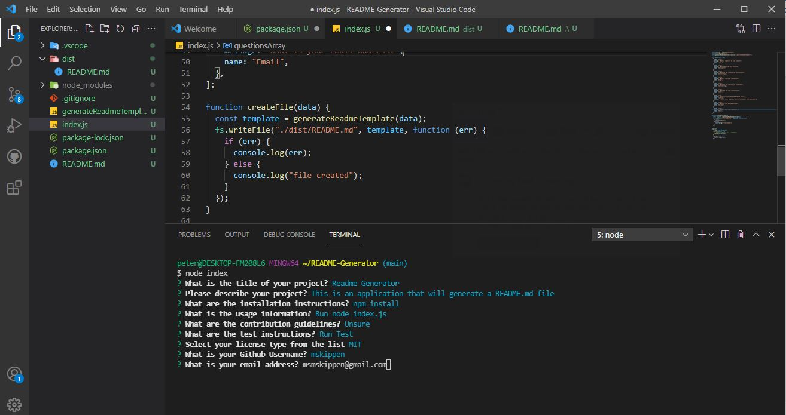

# Professional Readme Generator

## Licensing

## Table of Contents

- [Description](#description)
- [Installation](#installation)
- [Usage](#usage)
- [Additional Info](#additional-info)

## Visual Presentation

The full movie file showing functionality of the application can be found here through google drive: (<https://drive.google.com/drive/folders/1DK-jguR8tI7MdttriiKOIqJm2RFrNELw?usp=sharing>)

## Description

The above gif is a demonstration of how this 'deployed' application works. Created to generate README files that use a consistent format.

- WHEN I am prompted for information about my application repository
- THEN a high-quality, professional README.md is generated with the title of my project and sections entitled Description, Table of Contents, Installation, Usage, License, Contributing, Tests, and Questions
- WHEN I enter my project title
- THEN this is displayed as the title of the README
- WHEN I enter a description, installation instructions, usage information, contribution guidelines, and test instructions
- THEN this information is added to the sections of the README entitled Description, Installation, Usage, Contributing, and Tests
- WHEN I choose a license for my application from a list of options
- THEN a badge for that license is added near the top of the README and a notice is added to the section of the README entitled License that explains which license the application is covered under
- WHEN I enter my GitHub username
- THEN this is added to the section of the README entitled Questions, with a link to my GitHub profile
- WHEN I enter my email address
- THEN this is added to the section of the README entitled Questions, with instructions on how to reach me with additional questions
- WHEN I click on the links in the Table of Contents
- THEN I am taken to the corresponding section of the README

## Installation

- Download it through Github
- Pre-install inquirer <https://www.npmjs.com/package/inquirer>

## Usage

- Open terminal
- Type 'node index.js'
- Answer the prompts that follow
- On success a README.md will be generated.

## Additional Info

- Github: [mskippen](https://github.com/mskippen)
- Email: msmskippen@gmail.com
